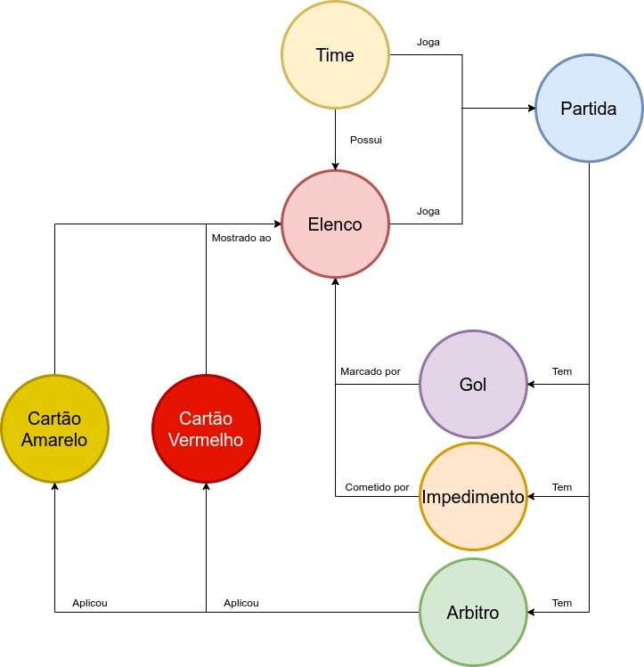
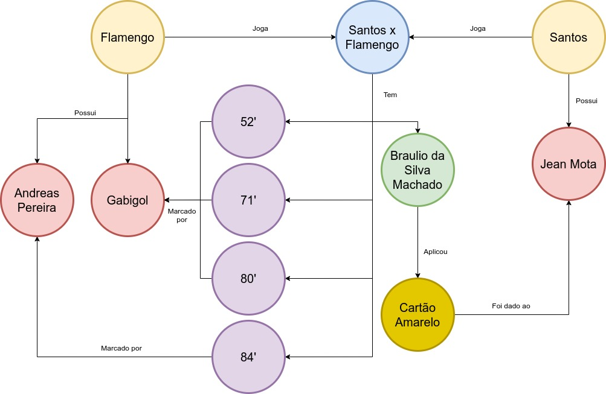

# Lab09 - Grafo de Conhecimento

# Aluno
* `193400`: `<Alan Freitas Ribeiro>`

## Exemplo de Grafo de Conhecimento - para publicar ou enriquecer
>
> Grafo de Classes:
> 
> 

| Recurso | Propriedade | Valor |
| --- | --- | --- |
| Time | Joga | Partida |
| Time | Possui | Elenco |
| Elenco | Joga | Partida |
| Partida | Tem | Gol |
| Partida | Tem | Impedimento |
| Partida | Tem | Arbitro |
| Gol | Marcado Por | Elenco |
| Impedimento | Cometido Por | Elenco |
| Arbitro | Aplicou | Cartão Amarelo |
| Arbitro | Aplicou | Cartão Vermelho |
| Cartão Amarelo | Mostrado ao | Elenco |
| Cartão Vermelho | Mostrado ao | Elenco |

> Grafo de Exemplos:
> 
> 

| Recurso | Propriedade | Valor |
| --- | --- | --- |

## Perguntas de Pesquisa ou Queries

> Liste aqui as três perguntas de pesquisa ou queries
> * Qual foi o jogador que mais marcou gols?
> * Quantos gols teve a partida 'x'?
> * O time mandante venceu?
